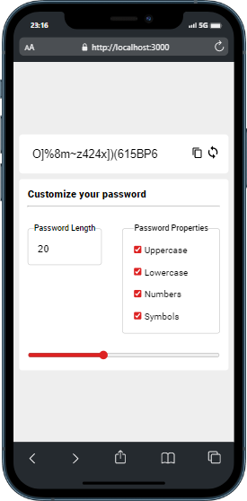
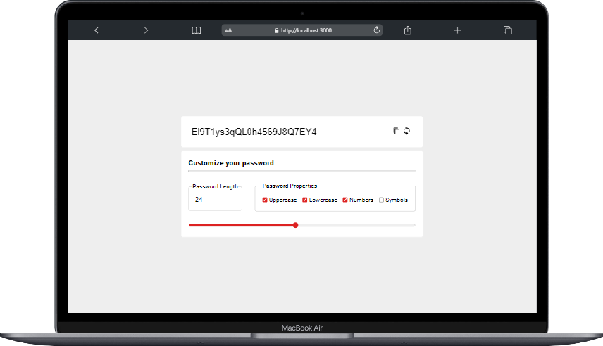

# React volkipassword :

### Proje özeti :

> Proje React ile yazıldı temel amaç güçlü password üretmek

### Proje durumu ve yapılacaklar :

- [x] normal password üretme
- [x] büyükharf küçükharf ve sayıları seçenek olarak sunma
- [x] sembolleri seçenek olarak sunma
- [x] input range ile password uzunluğu alma
- [ ] üretilen passwordun içeriğine göre kolay orta güçlü deme
- [x] passwordu kopyalayabilme
- [x] responsive tasarım

### Projede kullanılan Teknolojiler ve Metotlar :

> Projede useState, useEffect hook kullanıldı.
> stilendirme için herhangi bir kütüphane kullanılmadı pure css ile stilendirme yapıldı.
> context api kullanıldı
> kopyalama işlemi için recat copy clipboard kullanıldı
> deploy için vercel kullanıldı.

### proje font ve renk:

(font-family: 'Roboto', sans-serif;)
(background-color: #eeeeee;)
(App background-color: #EEEEEE;)

### Proje Adresi

[volkipassword](https://volkipassword.vercel.app/)

### Projenin Görselleri:

